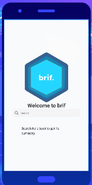
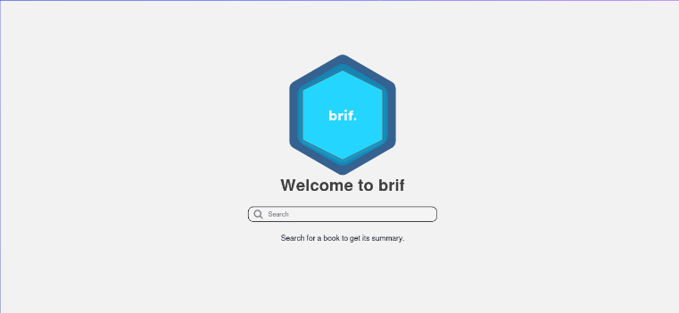
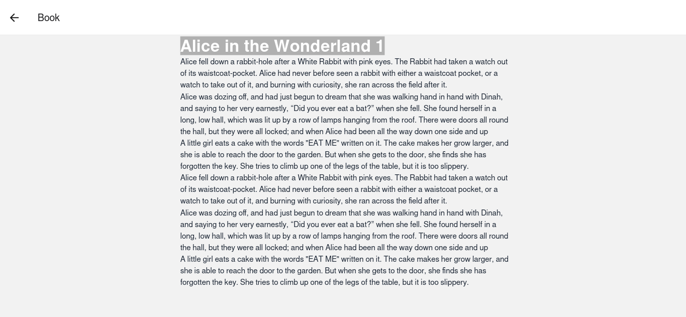

# brif.

A mobile/web platform that uses AI to deliver summaries of your favourite books and biographies completely for free!

## Business Plan
Our Business plan can be viewed [here](./BusinessPlan.md)

## Pitch
Our pitch for the makeathlon can be viewed [here](./pitch.md) or the slides [here](./presentation.pdf)

## Preview

### Mobile App:


### Web App:


### Web App Alice:


## Usage
1. Clone this repo
2. run 
```console
npm install
```
3. run 
```console
expo start 
```
4.  Also open the web version and enjoy!

